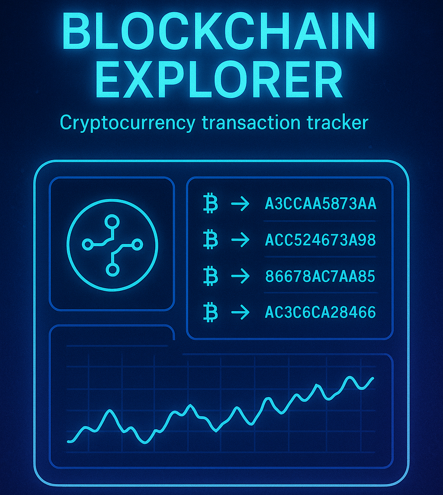

<!DOCTYPE html>
<html lang="en">
<head>
    <meta charset="UTF-8">
    <meta name="viewport" content="width=device-width, initial-scale=1.0">
    <title>Webburns_Tech</title>
    <link rel="stylesheet" href="base.css">
    <link rel="stylesheet" href="https://cdnjs.cloudflare.com/ajax/libs/font-awesome/6.4.0/css/all.min.css">
    <link href="https://fonts.googleapis.com/css2?family=Montserrat:wght@300;400;600;700&family=Orbitron:wght@400;600;700&display=swap" rel="stylesheet">

</head>
<body>
    <!-- Theme Toggle -->
    

        <i class="fas fa-moon"></i>
        <i class="fas fa-sun"></i>
    

    <!-- Navigation -->
    <nav class="navbar">
        

            <a href="#" class="logo">WebburnsTech</a>
            

                <a href="#home">Home</a>
                <a href="#about">About</a>
                <a href="#services">Services</a>
                <a href="#portfolio">Portfolio</a>
                <a href="#contact">Contact</a>
            

            

                
                
                
            

        

    </nav>

    <!-- Hero Section -->
    <section id="home" class="hero">
        

            <video autoplay muted loop  width="513" height="816" style="width: 100%; height: 100%;">
                <source src="videos/video_4.mp4" type="video/mp4">
            </video>
            

        

        

        

            <h1 class="hero-title">Building the Future of the Web Today</h1>
            
Next-generation web solutions for tomorrow's digital landscape

            

                <a href="#contact" class="btn btn-primary">Get Started</a>
                <a href="#portfolio" class="btn btn-secondary">Our Work</a>
            

            

                
                
                
            

        

    </section>

    <!-- About Section -->
    <section id="about" class="about">
        

            

                <h2>About Us</h2>
                
Innovation at the core of everything we do

            

            

                

                    
We are a next-generation web development company passionate about creating immersive, scalable, and powerful digital experiences. Our team combines creativity, technology, and strategy to bring your ideas to life through state-of-the-art web solutions. From concept to code, we believe in delivering excellence with a futuristic vision.

                    

                        

                            <h3 data-count="150">0</h3>
                            
Projects Completed

                        

                        

                            <h3 data-count="98">0</h3>
                            
Client Satisfaction

                        

                        

                            <h3 data-count="12">0</h3>
                            
Awards Won

                        

                    

                

                

                    

                        
                        

                    

                

            

        

    </section>

    <!-- Team Section -->
    <section class="team">
        

            

                <h2>Our Team</h2>
                
The minds behind the innovation

            

            

                

                    

                        
                        

                            <a href="#"><i class="fab fa-linkedin"></i></a>
                            <a href="#"><i class="fab fa-twitter"></i></a>
                            <a href="https://register360.github.io/webburnstech.com/" target="_blank"><i class="fab fa-github"></i></a>
                        

                    

                    <h3>T Vinay</h3>
                    
Lead Developer

                

                

                    

                        
                        

                            <a href="#"><i class="fab fa-linkedin"></i></a>
                            <a href="#"><i class="fab fa-twitter"></i></a>
                            <a href="https://www.instagram.com/pavanknani1/" target="_blank"><i class="fab fa-instagram"></i></a>
                        

                    

                    <h3>Pavan Nani</h3>
                    
UI/UX Designer

                

                

                    

                        
                        

                            <a href="#"><i class="fab fa-linkedin"></i></a>
                            <a href="#"><i class="fab fa-twitter"></i></a>
                            <a href="#"><i class="fab fa-instagram"></i></a>
                        

                    

                    <h3>Sunny Kiran</h3>
                    
Project Manager

                

            

        

    </section>

    <!-- Services Section -->
    <section id="services" class="services">
        

            

                <h2>Our Services</h2>
                
Comprehensive solutions for your digital needs

            

            

                

                    

                        <i class="fas fa-code"></i>
                    

                    <h3>Front-End Development</h3>
                    
Modern, responsive interfaces built with React, Vue, and cutting-edge CSS frameworks.

                    <a href="#" class="read-more">Learn more <i class="fas fa-arrow-right"></i></a>
                

                

                    

                        <i class="fas fa-server"></i>
                    

                    <h3>Back-End Development</h3>
                    
Scalable server architecture with Node.js, Python, and cloud solutions.

                    <a href="#" class="read-more">Learn more <i class="fas fa-arrow-right"></i></a>
                

                

                    

                        <i class="fas fa-paint-brush"></i>
                    

                    <h3>UI/UX Design</h3>
                    
User-centered designs that combine aesthetics with seamless functionality.

                    <a href="#" class="read-more">Learn more <i class="fas fa-arrow-right"></i></a>
                

                

                    

                        <i class="fas fa-mobile-alt"></i>
                    

                    <h3>Mobile Development</h3>
                    
Cross-platform mobile apps with React Native and Flutter.

                    <a href="#" class="read-more">Learn more <i class="fas fa-arrow-right"></i></a>
                

                

                    

                        <i class="fas fa-search"></i>
                    

                    <h3>SEO Optimization</h3>
                    
Increase visibility and drive organic traffic to your digital properties.

                    <a href="#" class="read-more">Learn more <i class="fas fa-arrow-right"></i></a>
                

                

                    

                        <i class="fas fa-chart-line"></i>
                    

                    <h3>Digital Strategy</h3>
                    
Comprehensive plans to maximize your online presence and ROI.

                    <a href="#" class="read-more">Learn more <i class="fas fa-arrow-right"></i></a>
                

            

        

    </section>

    <!-- Portfolio Section -->
    <section id="portfolio" class="portfolio">
        

            

                <h2>Our Portfolio</h2>
                
Showcase of our recent projects

            

            

                <button class="filter-btn active" data-filter="all">All</button>
                <button class="filter-btn" data-filter="web">Web</button>
                <button class="filter-btn" data-filter="mobile">Mobile</button>
                <button class="filter-btn" data-filter="design">Design</button>
            

            

                

                    
                    

                        <h3>Quantum Dashboard</h3>
                        
Analytics platform for financial data

                        <a href="#" class="view-project">View Project</a>
                    

                

                

                    
                    

                        <h3>Nexus Fitness App</h3>
                        
AI-powered workout companion

                        <a href="#" class="view-project">View Project</a>
                    

                

                

                    
                    

                        <h3>Cyberpunk Branding</h3>
                        
Visual identity for tech startup

                        <a href="#" class="view-project">View Project</a>
                    

                

                

                    
                    

                        <h3>Blockchain Explorer</h3>
                        
Cryptocurrency transaction tracker

                        <a href="#" class="view-project">View Project</a>
                    

                

                

                    
                    

                        <h3>AR City Guide</h3>
                        
Augmented reality navigation

                        <a href="#" class="view-project">View Project</a>
                    

                

                

                    
                    

                        <h3>Futuristic UI Kit</h3>
                        
Design system for web apps

                        <a href="#" class="view-project">View Project</a>
                    

                

            

        

    </section>

    <!-- Testimonials Section -->
    <section class="testimonials">
        

            

                <h2>Client Testimonials</h2>
                
What our clients say about us

            

            

                

                    

                        

                            <i class="fas fa-quote-left"></i>
                        

                        
"Webburns Tech transformed our online presence with their innovative approach. Their team delivered beyond our expectations with a website that perfectly captures our brand's futuristic vision."

                        

                            <h4>Jennifer K.</h4>
                            
CEO, TechVision Inc.

                        

                    

                

                

                    

                        

                            <i class="fas fa-quote-left"></i>
                        

                        
"The mobile app developed by Webburns Tech has been a game-changer for our business. Their attention to detail and user experience focus resulted in a product our customers love."

                        

                            <h4>David M.</h4>
                            
Founder, UrbanFit

                        

                    

                

                

                    

                        

                            <i class="fas fa-quote-left"></i>
                        

                        
"Working with Webburns Tech was a seamless experience. They understood our complex requirements and delivered a scalable solution that has grown with our business needs."

                        

                            <h4>Sarah L.</h4>
                            
CTO, DataSphere

                        

                    

                

            

            

                <button class="slider-prev"><i class="fas fa-chevron-left"></i></button>
                

                    
                    
                    
                

                <button class="slider-next"><i class="fas fa-chevron-right"></i></button>
            

        

    </section>

    <!-- Contact Section -->
    <section id="contact" class="contact">
        

            

                <h2>Contact Us</h2>
                
Let's build something amazing together

            

            

                

                    

                        

                            <i class="fas fa-map-marker-alt"></i>
                        

                        

                            <h3>Location</h3>
                            
123 Tech Avenue, Silicon Valley, CA 94025

                        

                    

                    

                        

                            <i class="fas fa-envelope"></i>
                        

                        

                            <h3>Email</h3>
                            
Webburns@tech.dev

                        

                    

                    

                        

                            <i class="fas fa-phone"></i>
                        

                        

                            <h3>Phone</h3>
                            
+91 (555) 123-4567

                        

                    

                    

                        <a href="#"><i class="fab fa-facebook-f"></i></a>
                        <a href="#"><i class="fab fa-twitter"></i></a>
                        <a href="#"><i class="fab fa-linkedin-in"></i></a>
                        <a href="#"><i class="fab fa-instagram"></i></a>
                        <a href="https://register360.github.io/webburnstech.com/"><i class="fab fa-github"></i></a>
                    

                

                

                    <form id="contactForm">
                        

                            <input type="text" id="name" name="name" placeholder="Your Name" required>
                        

                        

                            <input type="email" id="email" name="email" placeholder="Your Email" required>
                        

                        

                            <input type="text" id="subject" name="subject" placeholder="Subject">
                        

                        

                            <textarea id="message" name="message" placeholder="Your Message" required></textarea>
                        

                        <button type="submit" class="btn btn-primary">Send Message</button>
                    </form>
                

            

        

        

            <iframe src="https://www.google.com/maps/embed?pb=!1m18!1m12!1m3!1d3806.263031953117!2d78.5570383148769!3d17.4482999880448!2m3!1f0!2f0!3f0!3m2!1i1024!2i768!4f13.1!3m3!1m2!1s0x3bcb9a1a5e862d51%3A0x6c08e7b3b5e6b1b4!2sLB%20Nagar%2C%20Hyderabad%2C%20Telangana!5e0!3m2!1sen!2sin!4v1620000000000!5m2!1sen!2sin" allowfullscreen="" loading="lazy" referrerpolicy="no-referrer-when-downgrade"></iframe>
        

    </section>

    <!-- Footer -->
    <footer class="footer">
        

            

                

                    <a href="#" class="logo">WebburnsTech</a>
                    
Pushing the boundaries of web technology to create immersive digital experiences that shape the future.

                

                

                    <h3>Quick Links</h3>
                    <ul>
                        <li><a href="#home">Home</a></li>
                        <li><a href="#about">About</a></li>
                        <li><a href="#services">Services</a></li>
                        <li><a href="#portfolio">Portfolio</a></li>
                        <li><a href="#contact">Contact</a></li>
                    </ul>
                

                

                    <h3>Services</h3>
                    <ul>
                        <li><a href="#">Web Development</a></li>
                        <li><a href="#">Mobile Development</a></li>
                        <li><a href="#">UI/UX Design</a></li>
                        <li><a href="#">SEO Optimization</a></li>
                        <li><a href="#">Digital Strategy</a></li>
                    </ul>
                

                

                    <h3>Newsletter</h3>
                    
Subscribe to our newsletter for the latest updates.

                    <form id="newsletterForm">
                        <input type="email" placeholder="Your Email" required>
                        <button type="submit"><i class="fas fa-paper-plane"></i></button>
                    </form>
                

            

            

                
&copy; 2023 Webburns Tech. All Rights Reserved.

                

                    <a href="#">Privacy Policy</a>
                    <a href="#">Terms of Service</a>
                    <a href="#">Cookies Policy</a>
                

            

        

    </footer>

    <!-- Back to Top Button -->
    <a href="#home" class="back-to-top">
        <i class="fas fa-arrow-up"></i>
    </a>

    <!-- Scripts -->
     
    
    
</body>
</html>
