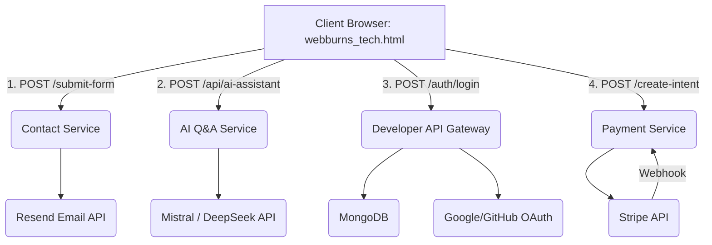

# ⚙️ WebburnsTech System Architecture (`ARCHITECTURE.md`)

This document provides a clear, high-level overview of the WebburnsTech system architecture. The system is designed as a **Service-Oriented Architecture (SOA)**, separating core application logic into specialized, independently deployable Node.js microservices.

-----

## 1\. Project Overview

**WebburnsTech** is a modern digital solutions company with a public marketing website, a portfolio showcase, and several integrated backend services for advanced functionality. The primary goal is to provide a scalable, high-performance web presence that integrates complex features like AI assistance, secure API management, and payment processing.

### High-Level Architecture

The system is divided into two primary layers:

1.  **Static Frontend:** The client-facing website and all static HTML pages.
2.  **Backend Microservices:** A collection of specialized Node.js/Express APIs that handle data persistence, business logic, and third-party integrations.

-----

## 2\. System Components (Microservices)

The WebburnsTech system is composed of the following distinct modules and services:

### 🌐 Frontend (Static Assets)

  * **Core Site:** (Files: `webburns_tech.html`, `videos/base.css`, `videos/base.js`, etc.) The main marketing site, hosting portfolio, services, and core UI.

### 💻 Backend Services

| Component | Purpose | Key Files |
| :--- | :--- | :--- |
| **Contact Service** | Handles submission and email confirmation for the main contact form. | `server/server.js` |
| **Developer API Gateway** | Manages user authentication (Login/Register/OAuth), JWT token issuance, API key generation, and usage tracking. | `Developer/server.js` |
| **Payment Service** | Processes transactions, handles payment intents, and manages Stripe webhooks for status updates. | `Payment Server/Server.js` |
| **Job Application Service** | Manages multi-part job application submissions, file uploads (Multer), and applicant email notifications. | `Job server/server.js` |
| **AI Q\&A Service (Mistral)** | Primary AI chatbot for company-specific, policy-driven Q\&A and support. | `AI Server/server.js` |
| **AI General Service (DeepSeek)** | Secondary AI engine for general knowledge assistance, programming help, and content generation. | `Deepseek Server/server.js` |
| **Feedback Service** | Collects and stores AI assistant feedback, sending confirmation emails. | `Feedback Server/server.js` |
| **Chat/Call Service (Real-time)** | Provides real-time chat (Firebase RTDB) and WebRTC signaling for voice/video calling (Socket.IO). | `mychat.html`, `mychat-/server.js` |

-----

## 3\. Technology Stack

| Layer | Technology | Key Libraries / Components |
| :--- | :--- | :--- |
| **Frontend** | HTML5, CSS3, JavaScript (ES6+) | Vanilla JS (e.g., `videos/base.js`), Particles.js, Font Awesome |
| **Backend (Core)** | **Node.js** (v16/18+), **Express.js** | `express`, `cors`, `dotenv`, `helmet`, `express-rate-limit` |
| **Databases** | **MongoDB** (via Mongoose) | `mongoose`, used by API Gateway, Payments, Job App, and Feedback services. |
| **AI/NLP** | External APIs, Node Libraries | **Mistral AI** (`@mistralai/mistralai`), **DeepSeek** (via `openai` SDK), `natural` NLP Library |
| **Authentication** | OAuth 2.0, JWT, Passport | `passport-google-oauth20`, `passport-github2`, `jsonwebtoken`, `bcryptjs` |
| **Communications** | Email, Real-time | **Resend** (Contact/Feedback), **Nodemailer** (Job App), **Firebase Realtime Database**, **Socket.IO**, **WebRTC** |
| **Payments** | Third-Party API | **Stripe SDK** |
| **File Handling** | Node.js Middleware | **Multer** (Job Application uploads) |

-----

## 4\. Data Flow & Integration

The system follows a typical Client-Server architecture, with the static front-end acting as the single point of entry that routes various requests to the appropriate backend microservice.

### Key Data Flows

1.  **Contact Form Submission:**

      * `webburns_tech.html` → `POST` Request to **Contact Service** (`server/server.js`)
      * **Contact Service** saves data (implied, or just emails) and sends confirmation/admin emails via **Resend**.

2.  **AI Assistant Query:**

      * `webburns_tech.html` → `POST` Request to **AI Q\&A Service** (`AI Server/server.js`).
      * **AI Service** sends the prompt (with system prompt) to **Mistral AI** or **DeepSeek** API.
      * External AI API returns the generated response to the **AI Service**.
      * **AI Service** returns the final text reply to the client.

3.  **Developer Authentication/Key Generation:**

      * Client requests login/register.
      * **Developer API Gateway** handles local login/registration, or redirects to **Google/GitHub OAuth** servers.
      * Upon successful authentication, the **Gateway** issues a **JWT Token** and/or generates an **API Key** (stored in **MongoDB**).

4.  **Payment Flow:**

      * Client request $\to$ **Payment Service** (`Payment Server/Server.js`).
      * **Payment Service** communicates with **Stripe API** to create a Payment Intent.
      * Stripe processes payment and sends a **Webhook** back to the designated endpoint in the **Payment Service** for transaction status update (stored in **MongoDB**).

<!-- end list -->

-----

## 5\. Deployment Architecture

The current architecture is a **Monorepo of Distributed Services** model, highly optimized for cloud platforms like **Render** or similar PaaS providers that support Node.js/Express applications.

  * **Frontend Deployment:** The static files (`webburns_tech.html`, `videos/`, `images/`, etc.) are typically deployed via a **CDN** (e.g., Netlify, GitHub Pages) for low latency and high availability.
  * **Backend Deployment:** Each microservice (`/server`, `/Developer`, `/AI Server`, etc.) is designed to be an **independent deployable unit** (potentially its own container/server instance) running on **Node.js/Express**.
      * Environment configuration is managed via **`.env` files** and runtime environment variables.
      * Database connection uses **MongoDB Atlas** (implied by connection strings found in files).
  * **Continuous Integration (CI):** Updates to the `main` branch trigger automated testing, building, and deployment processes (if configured).

-----

## 6\. Security Considerations

| Area | Measures in Place (Codebase Evidence) |
| :--- | :--- |
| **API/Auth** | Uses **JWT** for session management, **OAuth 2.0** for external login, **bcryptjs** for local password hashing. |
| **API Keys** | Implements API Key generation, validation middleware, revocation, and usage logging tied to user plans (`Developer/server.js`). |
| **HTTP Security** | Uses **Helmet** middleware for securing HTTP headers (e.g., CSP, XSS protection) (`Developer/server.js`, `Hacking/Server.js`). |
| **Rate Limiting** | **Express-rate-limit** is implemented on critical endpoints (login, API calls) to prevent brute-force attacks and resource abuse (`Developer/server.js`, `Hacking/Server.js`). |
| **Vulnerability Reporting** | A clear `SECURITY.md` file defines the responsible disclosure process, encouraging private email reporting to `security@webburnstech.dev`. |
| **Data Persistence** | **Mongoose/MongoDB** schemas are used, providing a layer of data validation and structure. |

-----

## 7\. Scalability & Performance

The distributed nature of the microservices architecture is the primary driver for scalability.

  * **Horizontal Scaling:** Since each service (Contact, Payments, Developer API) is stateless (aside from session storage and Redis/MongoDB), they can be **horizontally scaled** by running multiple instances behind a load balancer.
  * **Database Scaling:** **MongoDB** supports horizontal scaling through sharding, which is the long-term path for handling massive data volume growth.
  * **Front-End Performance:** Deploying the mostly static front-end via a **CDN** ensures low load times globally, while local JS (`videos/base.js`) handles client-side performance features (animations, filters).
  * **AI Service Isolation:** By isolating the latency-sensitive AI services, the rest of the core infrastructure remains unaffected by delays or outages in the external AI providers.
